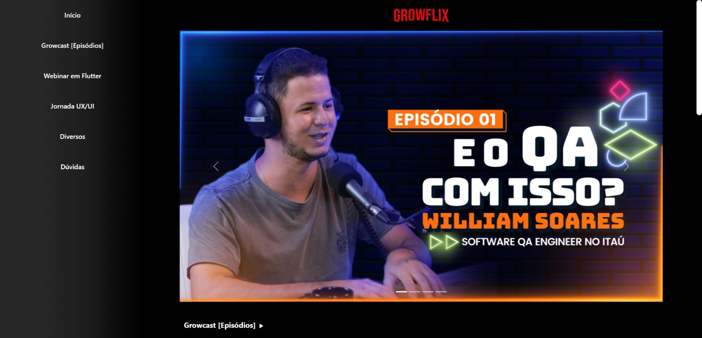

# 🤔 ABOUT 

At the moment (2023) I'm studying at [Growdev](https://www.growdev.com.br/) in their fullstack web developer course and I'm currently in the first Full Stack Project module. In the challenge of this module, we were asked to recreate the web application Growflix.

## 🎨 Layout

[Growflix](https://www.linkedin.com/in/jean-dresbach-a98a90293/?locale=en_US](https://growflix.vercel.app/index.html).

## 🚀 Features

- List of YouTube videos contained on the website and separated by category.

## Technologies used

- [HTML5](https://developer.mozilla.org/pt-BR/docs/Web/HTML)
- [Javascript](https://developer.mozilla.org/pt-BR/docs/Web/JavaScript)
- [CSS](https://developer.mozilla.org/pt-BR/docs/Web/CSS)
- [Bootstrap](https://getbootstrap.com)

Developed by [Jean Rafael Dresbach](https://www.linkedin.com/in/jean-dresbach-a98a90293/?locale=en_US).
